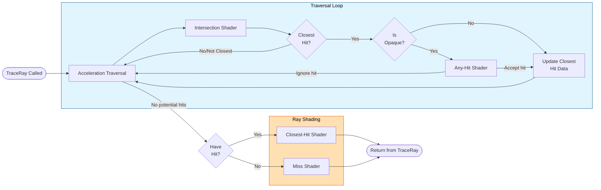

_This project has been created as part of the 42 curriculum by yzeybek, ibayandu._

# miniRT

## Description

### Project Goal 🎯

The goal of this project is building a minimal version of ray tracing engine. This engine, allows to rendering realistic computer-generated images from a simply formatted file. Also dealing with computer graphics world, develops learner in mathematical face of coding. Along with the already known concepts like; parsing, high scale project developing and necessary limitation chooses, project introduce; ray tracing pipeline, illumination types and geometry based rendering.

Geometry based rendering is one of the approaches that used in intersection process in rendering pipeline. Which is also better option to choose over physical based rendering for keeping minimal approach that subject recommends. End of the they we can say, also this project purposes to teach what actually different ways to implement graphical rendering and where to choose what and why...

Especially of usage mlx library that provided by 42 offical repository and allowance to other explicit libraries, aims to reach a project that almost industry standart ray tracing engine. Keeping these implementations with Norm V4 rules, helps to keeping structure clean despite the large scale project.

### Project Overview 🔍

General structure of this project shapes around of general C projects structure and parser/renderer logic at the core of engine. Here is the folders and what they used for:

	├── .
	├── ..
	├── build                   # *.o files that comes from *.c compilation
	├── incs                    # *.h files that has prototypes or structures for sources
	├── libs                    # lib* folders that used in this project
	│   ├── libft               # Library that has useful Libc function implementations
	│   ├── libgnl              # Library that has file reading operations
	│   ├── libmem              # Library that has mini implementation of garbage collector
	│   ├── libvec              # Library that has vector math operations
	│   └── (minilibx-linux)    # Library that has mini implementatio of X Window functions (called by make)
	├── scenes                  # Example scene files
	├── srcs                    # Actual C files runs engine
	│   ├── parser              # Parser logic that parses .rt files
	│   │   ├── parse_funcs     # Explicit functions that parse spesific identifiers
	│   │   └── ...             # Other parser helper files
	│   ├── render              # Renderer logic that renders given scene
	│   │   └── ...             # Source files for rendering
	│   └── ...                 # Other mainly used files
	└── ...                     # Folder root files (Makefile and README.md)

After sharing this general structure, we can proceed with parser logic. Which uses pretty simple line parsing algorithm. Since the given .rt files has the structure of ```[identifier][properties]``` with each line of file, this choose is pretty efficient. Some of the identifier are must to have because of they are explicitly defines scene abilities:
- "A" For Ambient Lightning
- "C" For Camera
- "L" For Mandatory Light

And here is the ones that not necessary to define but our RT can render:
- "l" For Bonus Light
- "pl" For Plane Shape
- "sp" For Sphere Shape
- "cn" For Cone Shape
- "cy" For Cylinder Shape
- "#" For Commenting

Each identifier has properties for required when rendering that object. These properties are not be included in here for incresing text. Anyone that wonders can checkout scenes and rendering logic. Better to talk about how ray tracing engine works after all these parsing ends...

Ray tracer, simply creates a ray from camera to each pixel onto screen. Then traces that lines if they are hits a shape and light. If there is a hit, it runs hit shader. If there is not hit, it runs miss shader. Miss shader simply returns black color for representing background. On the other hand, the hit shader does actual job. All the phong illumination and shadowing logic handles by that. For better understanding this loop here is an representative image that taken from actual nvidia's Ray Tracing pipeline:



Finally, rendering process ends with putting colored image into window. Both image putting and (previously) window creating operations are handled via minilibx-linux library that provided by 42 offical repository. This library allows to run X window calls with simplified version. Since the talking about this library won't end, [here](https://github.com/42paris/minilibx-linux) is the offical repo for who wants to examine.

## Instructions

### Installation ⬇️

This project is publicly available on yzeybek's github repository that named as miniRT. So simply clonning that repository via https is pretty enough for installation. Here is example command:

```bash
git clone https://github.com/yzeybek/miniRT.git
```

### Compilation 🧑‍💻

Our project uses Makefile for handling all compilation process. Which allows to compile all code with simple ```make``` command on project directory. The Makefile compiles every existing source files all together along with the libraries. But since the minilibx-linux library may not include on **libs** directory, it also clones via offical repository.

> [!NOTE]
>
> Since the compilation has been strictly modified for 42 campus computers, there can be errors on other > environments. Here is some consideration:
>- The campus computers are Linux, so can be error occur on MacOS's.
>- The campus computers are using clang as link of **cc**. For changing the compiler, update the Makefile or change the ```cc``` command link.
>- The compilation process uses default optimization provided by compiler because of not explicitly allowed on Norm V4. So it might be better to compile with ```-O3``` flag for faster rendering.

### Execution ⚙️

Project executable (`miniRT` file) requires a file that ends with **.rt** extension. So here is an example call:

```bash
./miniRT scenes/stickman.rt
```

After this execution, engine will render after a while that changes by given file size. Ends of the rendering process, window can cleanly closable from close button or ESC click on keyboard.

## Resources

### Usage Of Sources 📋

1. [If need to start from scratch. (other episodes watchable if more needed)](https://youtu.be/fNk_zzaMoSs?feature=shared)

2. [Mathematical Background of RT.](http://www.youtube.com/playlist?list=PLAqGIYgEAxrUO6ODA0pnLkM2UOijerFPv)

3. [Quick recap of RT journey.](https://youtu.be/wzZJzyX0UkI?feature=shared)

4. [Actual guide on process.](https://youtube.com/playlist?list=PLlrATfBNZ98edc5GshdBtREv5asFW3yXl&feature=shared)

5. [Genius guy making genius stuff.](https://youtube.com/playlist?list=PLy68GuC77sUTyOUvDhVboQoOlHoa4XrSO&feature=shared)

6. [Books that highly recommended.](https://raytracing.github.io/)

7. [Worth to read for better understanment.](https://en.m.wikipedia.org/wiki/Phong_reflection_model)

8. [Nice coding introduction to phong lighting.](https://www.youtube.com/watch?v=LKXAIuCaKAQ)

9. [Almost offical document for geometrical rendering.](https://www.geometrictools.com/Documentation/Documentation.html)

10. [The guy that makes ShaderToy and stuff.](https://iquilezles.org/)

### Usage Of AI's 🤖

We carried about avoiding usage of vibe coding tools on creation process of this project. Which allows us to actually showing our ***development*** skills. On the other hand, we got some help from AI chatting tools for:
- Understanding complex math implementations
- Planning our pipeline or project structure
- Resource finding as quick search of internet.

End of the day, we were carreful about using AI as a tool instead of letting it to do the all job of us. Which is prevents to AI, use we as a tool for developing this project :)
